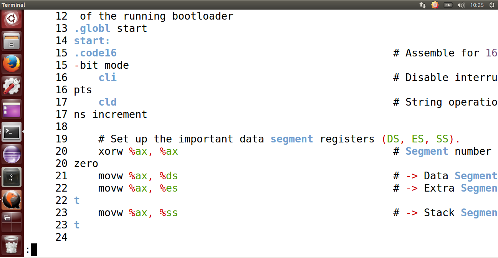
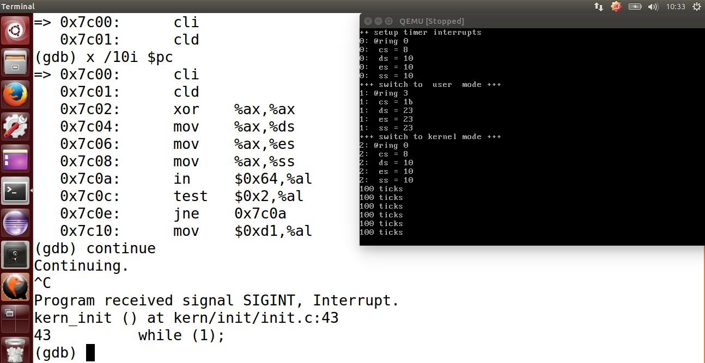
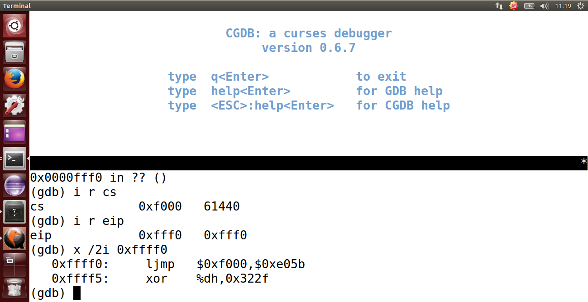
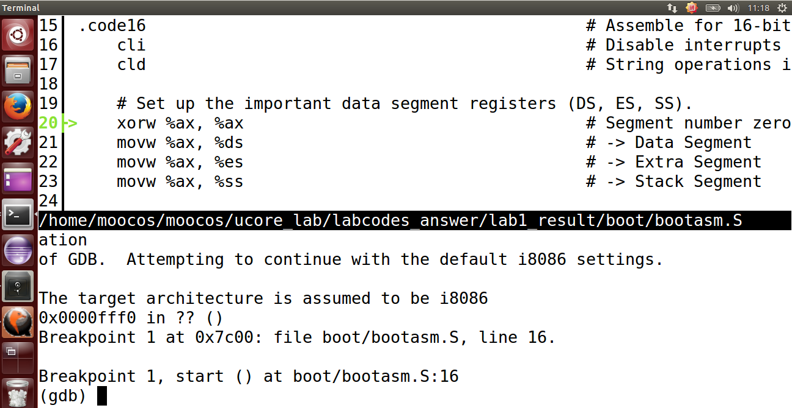
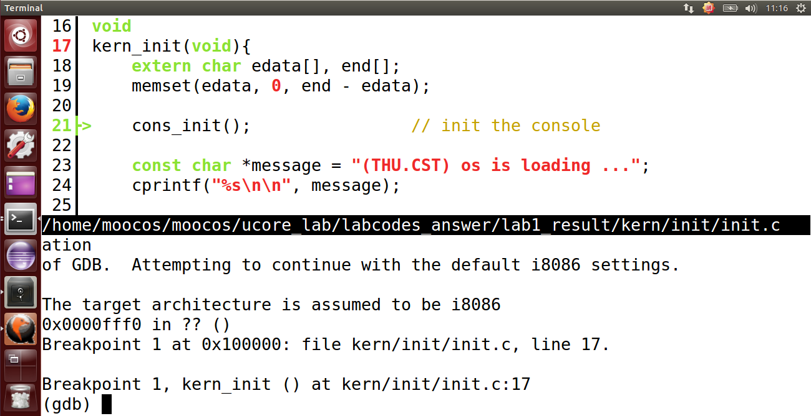
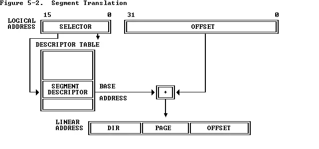
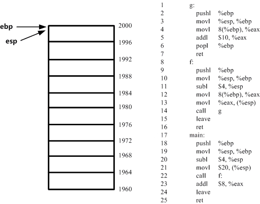
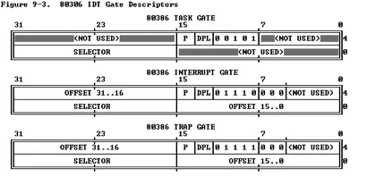
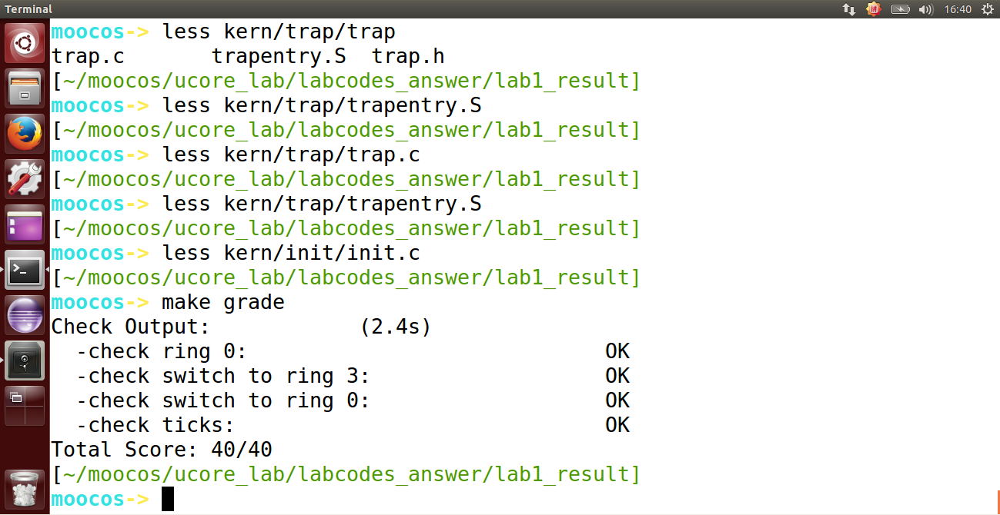

## lab1 实验报告

### 练习1：理解通过make生成执行文件的过程

> 问题1：操作系统镜像文件ucore.img是如何一步一步生成的？

进入 `/home/moocos/ucore_lab/labcodes_answer/lab1_result` 目录下

执行 `make "V="`， 观察生成 `ucore.img` 的过程

> 如果当前目录已有 `/bin/` 目录和 `/obj/` 目录，我们先去执行 `make clean` ，再执行 `make "V="` 观察 `ucore.img` 的生成过程。

核心的打印结果如下：

```bash
# 构建bin/kernel
+ cc kern/init/init.c
+ cc kern/libs/readline.c
+ cc kern/libs/stdio.c
+ cc kern/debug/kdebug.c
+ cc kern/debug/kmonitor.c
+ cc kern/debug/panic.c
+ cc kern/driver/clock.c
+ cc kern/driver/console.c
+ cc kern/driver/intr.c
+ cc kern/driver/picirq.c
+ cc kern/trap/trap.c
+ cc kern/trap/trapentry.S
+ cc kern/trap/vectors.S
+ cc kern/mm/pmm.c
+ cc libs/printfmt.c
+ cc libs/string.c
+ ld bin/kernel
# 构建sign工具与bin/bootblock
+ cc boot/bootasm.S
+ cc boot/bootmain.c
+ cc tools/sign.c
# 使用gcc编译器由tools/sign.c生成可执行文件bin/sign
    gcc -Itools/ -g -Wall -O2 -c tools/sign.c -o obj/sign/tools/sign.o
    gcc -g -Wall -O2 obj/sign/tools/sign.o -o bin/sign
# 使用ld命令链接/boot/bootasm.o、obj/boot/bootmain.o到obj/bootblock.o
+ ld bin/bootblock
    ld -m    elf_i386 -nostdlib -N -e start -Ttext 0x7C00 obj/boot/bootasm.o 
    obj/boot/bootmain.o -o obj/bootblock.o
    'obj/bootblock.out' size: 472 bytes
    build 512 bytes boot sector: 'bin/bootblock' success!
# 构建ucore.img
dd if=/dev/zero of=bin/ucore.img count=10000 # 使用dd工具创建一个bin/ucore.img空文件
10000+0 records in
10000+0 records out
5120000 bytes (5.1 MB) copied, 0.0456474 s, 112 MB/s
dd if=bin/bootblock of=bin/ucore.img conv=notrunc # 使用dd工具将文件bin/bootblock写入bin/ucore.img, 参数conv=notrunc表示不截断输出文件
1+0 records in
1+0 records out
512 bytes (512 B) copied, 0.00281044 s, 182 kB/s
dd if=bin/kernel of=bin/ucore.img seek=1 conv=notrunc # 使用dd工具将文件bin/kernel写入bin/ucore.img起始的1个block后，即bootblock后, 参数seek=1表示从输出文件开头跳过1个block开始写入
138+1 records in
138+1 records out
70775 bytes (71 kB) copied, 0.000473867 s, 149 MB/s
```

由以上过程可知

- 编译16个内核文件，构建出内核`bin/kernel` 
- 生成 `bin/bootblock` 引导程序
  - 编译`bootasm.S，bootmain.c`，链接生成`obj/bootblock.o` 
  - 编译`sign.c`生成`sign.o`工具
  - 使用`sign.o`工具规范化`bootblock.o`，生成`bin/bootblock`引导扇区
- 生成 `ucore.img`  虚拟磁盘
  -  `dd`初始化`ucore.img`为`5120000 bytes`，内容为0的文件
  -  `dd`拷贝`bin/bootblock`到`ucore.img`第一个扇区
  -  `dd`拷贝`bin/kernel`到`ucore.img`第二个扇区往后的空间

> 问题2：一个被系统认为是符合规范的硬盘主引导扇区的特征是什么？

根据问题1可知通过`sign.c`文件的操作使得`bootblock.o`成为一个符合规范的引导扇区，因此查看`sign.c`的内容，如下所示：

```c
#include <stdio.h>
#include <errno.h>
#include <string.h>
#include <sys/stat.h>

int main(int argc, char *argv[]) {
    struct stat st;
    // 输入状态判断
    if (argc != 3) {
        fprintf(stderr, "Usage: <input filename> <output filename>\n");
        return -1;
    }
    // 读取文件头
    if (stat(argv[1], &st) != 0) {
        fprintf(stderr, "Error opening file '%s': %s\n", argv[1], strerror(errno));
        return -1;
    }
    // 问题1中输出的文件大小
    printf("'%s' size: %lld bytes\n", argv[1], (long long)st.st_size);
    // 文件大小超过510字节报错返回，因为最后2个字节要用作结束标志位
    if (st.st_size > 510) {
        fprintf(stderr, "%lld >> 510!!\n", (long long)st.st_size);
        return -1;
    }
    // 多余位用0填充
    char buf[512];
    memset(buf, 0, sizeof(buf));
    FILE *ifp = fopen(argv[1], "rb");
    int size = fread(buf, 1, st.st_size, ifp);
    // 文件实际大小需和文件头描述一致
    if (size != st.st_size) {
        fprintf(stderr, "read '%s' error, size is %d.\n", argv[1], size);
        return -1;
    }
    fclose(ifp);
    buf[510] = 0x55;
    buf[511] = 0xAA;
    // 写入结束位
    FILE *ofp = fopen(argv[2], "wb+");
    size = fwrite(buf, 1, 512, ofp);
    if (size != 512) {
        fprintf(stderr, "write '%s' error, size is %d.\n", argv[2], size);
        return -1;
    }
    fclose(ofp);
    printf("build 512 bytes boot sector: '%s' success!\n", argv[2]);
    return 0;
}
```

由以上代码可知，硬盘主引导扇区特征为：

- 大小为512字节，空余部分用0填充
- 文件内容不超过`510 bytes`
- 最后`2 bytes`为`0x55 0xAA`

### 练习2：使用qemu执行并调试lab1中的软件

> 1. 从CPU加电后执行的第一条指令开始，单步跟踪BIOS的执行。
> 2. 在初始化位置0x7c00设置实地址断点,测试断点正常。
> 3. 从0x7c00开始跟踪代码运行,将单步跟踪反汇编得到的代码与bootasm.S和 bootblock.asm进行比较。
> 4. 自己找一个bootloader或内核中的代码位置，设置断点并进行测试。

我们可以先看看 Makefile 文件里面都需要干哪些事情。

我们在 `/home/moocos/ucore_lab/labcodes_answer/lab1_result` 目录下使用 `less Makefile` 命令去浏览 Makefile 文件中的内容，通过 `/lab1-mon` 去定位到相应行数的代码（这里我们是201行）。

```bash
lab1-mon: $(UCOREIMG)
				$(V)$(TERMINAL) -e "$(QEMU) -S -s -d in_asm -D $(BINDIR)/q.log -monitor stdio -hda $< -serial null" -g -monitor stdio -hda $< -serial null"
				$(V)sleep 2
				$(V)$(TERMINAL) -e "gdb -q -x tools/lab1init"
```

我们可以看到这条命令大概干了两件事情：

- 第一个是让 qemu 把它执行的指令给记录下来，放到 q.log 这个地方
- 第二个是和 gdb 结合来调试正在执行的 Bootloader

我们看看初始化执行指令中都有哪些内容，我们使用如下命令：

```bash
less tools/lab1init
```

会显示如下内容：

```bash
file /bin/kernel
target remote :1234
set architecture i8086
b *0x7c00
continue
x /2i $pc
```

它大概干了如下的一些事情：

- 第一条指令是加载 bin/kernel。（加载符号信息，事实上是ucore的信息）
- 第二条指令是与 qemu 进行连接，通过这个TRP进行连接
- 刚开始的时候，BIOS是进入8086的16位实模式方式，一直到0x7c00。在BIOS这个阶段，启动，最后把Bootloader加载进去，把控制权交给Bootloader，那么Bootloader第一条指令就是在0x7c00处，所以我们在这个地方设置一个断点，break 0x7c00
- 然后让这个系统继续运行，那么我们就会看到它会在这个断点处停下来，那我们可以把相应的这个指令给打印出来。
- 最后一条指令的意思是把PC(也就是EIP，即指令指针寄存器)，它存在当前正在执行这个指令的地址，
  那么x是显示的意思，／2i是显示两条，i是指令。

我们尝试用命令去执行一下 `bootloader`第一条指令看看效果：

```bash
make lab1-mon
```


我们可以看到，qemu 已经启动起来了。但是它断下来了，断在哪里呢？我们可以看到断点箭头指向 0x7c00 处。我们还可以显示更多的条数信息，比如我们可以执行 `x /10i $pc` ，可以把当前的10条指令都显示出来。

```bash
(gdb) x /10i $pc
=> 0x7c00:      cli    
   0x7c01:      cld    
   0x7c02:      xor    %ax,%ax
   0x7c04:      mov    %ax,%ds
   0x7c06:      mov    %ax,%es
   0x7c08:      mov    %ax,%ss 
   0x7c0a:      in     $0x64,%al
   0x7c0c:      test   $0x2,%al
   0x7c0e:      jne    0x7c0a
   0x7c10:      mov    $0xd1,%al
```

而这些指令都在哪里呢？

我们可以查看 boot/bootasm.S 文件，可以看到，如下图所示的代码和我们看到 gdb 里面的指令是一样的。



我们已经断到 Bootloader 起始的位置，我们接下来可以让它继续运行。

```bash
continue
```

可以看到效果：



这时候我们可以看到 Bootloader 已经加载进来了。

我们修改`tools/gdbinit`如下：

```bash
set architecture i8086
target remote :1234
```

在 `/home/moocos/ucore_lab/labcodes_answer/lab1_result`下执行`make debug`：



- 此时`CS`为`0xF000`，`PC`为`0xFFF0`，内存地址为`0xFFFF0` 
- 可知，`CPU`加电后第一条执行位于`0xFFFF0`，并且第一条指令为长跳转指令
- 可知，BIOS实例存储在`cs:ip`为`0xf000:0xe05b`的位置
- 使用`si`命令可对BIOS进行单步跟踪

我们再对 `tools/gdbinit` 做如下修改：

```bash
file obj/bootblock.o
set architecture i8086
target remote :1234
b *0x7c00
continue
```

在 `/home/moocos/ucore_lab/labcodes_answer/lab1_result`下执行`make debug`：



- 调试发现`0x7C00`为主引导程序的入口地址，代码与`bootasm.S`一致
- 使用ni可进行单步调试

我们再对 `tools/gdbinit` 做如下修改：

```bash
file bin/kernel
set architecture i8086
target remote :1234
b kern_init
continue
```

在 `/home/moocos/ucore_lab/labcodes_answer/lab1_result`下执行`make debug`：



- 在内核入口处增加断点，可以看到代码停在`kern_init`函数
- 使用ni可进行单步调试

### 练习3：分析bootloader进入保护模式的过程

事实上，Bootloader 完成了一些最基本的功能，比如 它能够把80386的保护模式给开启，使得现在的软件进入了一个32位的寻址空间，这就是我们的寻址方式发生了变化。为了做好这一步，它需要干如下一些事情：

- 开启A20
- 初始化GDT表(全局描述符表)
- 使能和进入保护模式

> 为何开启A20，以及如何开启A20

在`i8086`时代，`CPU`的数据总线是`16bit`，地址总线是`20bit`(20根地址总线)，寄存器是`16bit`，因此CPU只能访问`1MB`以内的空间。因为数据总线和寄存器只有`16bit`，如果需要获取`20bit`的数据, 我们需要做一些额外的操作，比如移位。实际上，`CPU`是通过对`segment`(每个`segment`大小恒定为`64K`) 进行移位后和`offset`一起组成了一个`20bit`的地址，这个地址就是实模式下访问内存的地址：

```bash
address = segment << 4 | offset
```

理论上，`20bit`的地址可以访问`1MB`的内存空间`(0x00000 - (2^20 - 1 = 0xFFFFF))`。但在实模式下, 这`20bit`的地址理论上能访问从`0x00000 - (0xFFFF0 + 0xFFFF = 0x10FFEF)`的内存空间。也就是说，理论上我们可以访问超过1MB的内存空间，但越过`0xFFFFF`后，地址又会回到`0x00000`。

上面这个特征在`i8086`中是没有任何问题的(因为它最多只能访问`1MB`的内存空间)，但到了`i80286/i80386`后，`CPU`有了更宽的地址总线，数据总线和寄存器后，这就会出现一个问题： 在实模式下, 我们可以访问超过`1MB`的空间，但我们只希望访问 `1MB` 以内的内存空间。为了解决这个问题， `CPU`中添加了一个可控制`A20`地址线的模块，通过这个模块，我们在实模式下将第`20bit`的地址线限制为`0`，这样`CPU`就不能访问超过`1MB`的空间了。进入保护模式后，我们再通过这个模块解除对`A20`地址线的限制，这样我们就能访问超过`1MB`的内存空间了。

> 注：事实上，A20就是第21根线，用来控制是否允许对 0x10FFEF 以上的实际内存寻址。称为A20 Gate

默认情况下，`A20`地址线是关闭的(`20bit`以上的地址线限制为`0`)，因此在进入保护模式(需要访问超过`1MB`的内存空间)前，我们需要开启`A20`地址线(`20bit`以上的地址线可为`0`或者`1`)。具体代码如下：

```assembly
seta20.1:
    inb $0x64, %al                                  # Wait for not busy(8042 input buffer empty).
    testb $0x2, %al
    jnz seta20.1

    movb $0xd1, %al                                 # 0xd1 -> port 0x64
    outb %al, $0x64                                 # 0xd1 means: write data to 8042's P2 port

seta20.2:
    inb $0x64, %al                                  # Wait for not busy(8042 input buffer empty).
    testb $0x2, %al
    jnz seta20.2

    movb $0xdf, %al                                 # 0xdf -> port 0x60
    outb %al, $0x60                                 # 0xdf = 11011111, means set P2's A20 bit(the 1 bit) to 1
```

> 如何初始化GDT表

首先咱们要引入GDT的概念，GDT到底是什么呢？

在Protected Mode下，一个重要的必不可少的数据结构就是GDT（Global Descriptor Table）。 

为什么要有GDT？我们首先考虑一下在Real Mode下的编程模型： 

在Real Mode下，我们对一个内存地址的访问是通过 Segment:Offset 的方式来进行的，其中 Segment 是一个段的Base Address，一个 Segment 的最大长度是64 KB，这是16-bit系统所能表示的最大长度。而 Offset 则是相对于此 Segment Base Address 的偏移量。Base Address+Offset 就是一个内存绝对地址。由此，我们可以看出，一个段具备两个因素：

- Base Address
- Limit（段的最大长度）

而对一个内存地址的访问，则是需要指出：使用哪个段？以及相对于这个段 Base Address 的 Offset，这个Offset应该小于此段的Limit。当然对于16-bit系统，Limit 不要指定，默认为最大长度64KB，而 16-bit 的 Offset 也永远不可能大于此Limit。我们在实际编程的时候，使用16-bit段寄存器CS（Code Segment），DS（Data Segment），SS（Stack Segment）来指定Segment，CPU将段积存器中的数值向左偏移4-bit，放到20-bit的地址线上就成为20-bit的Base Address。 

到了Protected Mode，内存的管理模式分为两种，段模式和页模式，其中页模式也是基于段模式的。也就是说，Protected Mode的内存管理模式事实上是：纯段模式和段页式。进一步说，段模式是必不可少的，而页模式则是可选的——如果使用页模式，则是段页式；否则这是纯段模式。 

既然是这样，我们就先不去考虑页模式。对于段模式来讲，访问一个内存地址仍然使用Segment:Offset的方式，这是很自然的。由于 Protected Mode运行在32-bit系统上，那么Segment的两个因素：Base Address和Limit也都是32位的。

IA-32允许将一个段的Base Address设为32-bit所能表示的任何值（Limit则可以被设为32-bit所能表示的，以2^12为倍数的任何指），而不像 Real Mode 下，一个段的 Base Address 只能是16的倍数（因为其低4-bit是通过左移运算得来的，只能为0，从而达到使用16-bit段寄存器表示20-bit Base Address的目的），而一个段的Limit只能为固定值64 KB。另外，Protected Mode，顾名思义，又为段模式提供了保护机制，也就说一个段的描述符需要规定对自身的访问权限（Access）。

所以，在Protected Mode下，对一个段的描述则包括3方面因素：[Base Address, Limit, Access]，它们加在一起被放在一个64-bit长的数据结构中，被称为段描述符。这种情况下，如果我们直接通过一个64-bit段描述符来引用一个段的时候，就必须使用一个64-bit长的段积存器装入这个段描述符。但 Intel 为了保持向后兼容，将段积存器仍然规定为16-bit（尽管每个段积存器事实上有一个64-bit长的不可见部分，但对于程序员来说，段积存器就是16-bit的），那么很明显，我们无法通过16-bit长度的段积存器来直接引用64-bit的段描述符。 

怎么办？解决的方法就是把这些长度为64-bit的段描述符放入一个数组中，而将段寄存器中的值作为下标索引来间接引用（事实上，是将段寄存器中的高13 -bit的内容作为索引）。这个全局的数组就是GDT。事实上，在GDT中存放的不仅仅是段描述符，还有其它描述符，它们都是64-bit长，我们随后再讨论。 

GDT可以被放在内存的任何位置，那么当程序员通过段寄存器来引用一个段描述符时，CPU必须知道GDT的入口，也就是基地址放在哪里，所以 Intel的设计者门提供了一个寄存器GDTR用来存放GDT的入口地址，程序员将GDT设定在内存中某个位置之后，可以通过 LGDT 指令将 GDT 的入口地址装入此积存器，从此以后，CPU 就根据此积存器中的内容作为 GDT 的入口来访问GDT了。 

GDT是Protected Mode所必须的数据结构，也是唯一的——不应该，也不可能有多个。另外，正如它的名字（Global Descriptor Table）所蕴含的，它是全局可见的，对任何一个任务而言都是这样。 

除了GDT之外，IA-32还允许程序员构建与GDT类似的数据结构，它们被称作LDT（Local Descriptor Table），但与GDT不同的是，LDT在系统中可以存在多个，并且从LDT的名字可以得知，LDT不是全局可见的，它们只对引用它们的任务可见，每个任务最多可以拥有一个LDT。另外，每一个LDT自身作为一个段存在，它们的段描述符被放在GDT中。 

IA-32为LDT的入口地址也提供了一个寄存器LDTR，因为在任何时刻只能有一个任务在运行，所以LDT寄存器全局也只需要有一个。如果一个任务拥有自身的LDT，那么当它需要引用自身的LDT时，它需要通过LLDT将其LDT的段描述符装入此寄存器。LLDT指令与LGDT指令不同的时，LGDT指令的操作数是一个32-bit的内存地址，这个内存地址处存放的是一个32-bit GDT的入口地址，以及16-bit的GDT Limit。而LLDT指令的操作数是一个16-bit的选择子，这个选择子主要内容是：被装入的LDT的段描述符在GDT中的索引值——这一点和刚才所讨论的通过段积存器引用段的模式是一样的。

GDT的结构图如下：（GDT表相当于一个64bit的数组）


可以看出这里所有`GDT表项`(除了空段)初始化为全段，此时段偏移量`EIP`等于物理地址

```assembly
...
#define SEG_NULLASM                                             \
    .word 0, 0;                                                 \
    .byte 0, 0, 0, 0

#define SEG_ASM(type,base,lim)                                  \
    .word (((lim) >> 12) & 0xffff), ((base) & 0xffff);          \
    .byte (((base) >> 16) & 0xff), (0x90 | (type)),             \
        (0xC0 | (((lim) >> 28) & 0xf)), (((base) >> 24) & 0xff)
...
lgdt gdtdesc
...
gdt:
    SEG_NULLASM                                     # null seg
    SEG_ASM(STA_X|STA_R, 0x0, 0xffffffff)           # code seg for bootloader and kernel
    SEG_ASM(STA_W, 0x0, 0xffffffff)                 # data seg for bootloader and kernel

gdtdesc:
    .word 0x17                                      # sizeof(gdt) - 1
    .long gdt                                       # address gdt
```

**段选择子**

在实模式下, 逻辑地址由段选择子和段选择子偏移量组成. 其中, 段选择子16bit, 段选择子偏移量是32bit. 下面是段选择子的示意图：


- 在段选择子中，其中的INDEX[15:3]是GDT的索引。
- TI[2:2]用于选择表格的类型，1是LDT，0是GDT。
- RPL[1:0]用于选择请求者的特权级，00最高，11最低。

**GDT的访问**

有了上面这些知识，我们可以来看看到底应该怎样通过GDT来获取需要访问的地址了。我们通过这个示意图来讲解：

 

- 根据CPU给的逻辑地址分离出段选择子。
- 利用段选择子查找到对应的段描述符。
- 将段描述符里的Base Address和EIP相加而得到线性地址。

> 如何使能和进入保护模式

开启A20，初始化gdt后，将控制寄存器`CR0`的`PE(bit0)`置为`1`即可。

```assembly
movl %cr0, %eax
orl 0x1, %eax
movl %eax, %cr0
```

> bootloader进入保护模式的过程

```
* bootloader开始运行在实模式，物理地址为0x7c00,且是16位模式
* bootloader关闭所有中断，方向标志位复位，ds，es，ss段寄存器清零
* 打开A20使之能够使用高位地址线
* 由实模式进入保护模式，使用lgdt指令把GDT描述符表的大小和起始地址存入gdt寄存器，修改寄存器CR0的最低位（orl $CR0_PE_ON, %eax）完成从实模式到保护模式的转换，使用ljmp指令跳转到32位指令模式
* 进入保护模式后，设置ds，es，fs，gs，ss段寄存器，堆栈指针，便可以进入c程序bootmain
```

### 练习4：分析bootloader加载ELF格式的OS的过程

进入保护模式之后，Bootloader 需要干的很重要的一件事就是加载 ELF 文件。因为我们的 kernel（也就是ucore OS）是以 ELF 文件格式存在硬盘上的。

```bash
[~/moocos/ucore_lab/labcodes_answer/lab1_result]
moocos-> file bin/kernel
bin/kernel: ELF 32-bit LSB executable, Intel 80386, version 1(SYSV), statically linked, not stripped
```

- 定义ELF头指针，指向`0x10000` 
- 读取`8`个扇区大小的`ELF`头到内存地址`0x10000` 
- 校验`ELF header`中的模数，判断是否为`0x464C457FU` 
- 读取`ELF header`中的程序段到内存中
- 跳转到操作系统入口

- 定义ELF头指针，指向`0x10000` 
- 读取`8`个扇区大小的`ELF`头到内存地址`0x10000` 
- 校验`ELF header`中的模数，判断是否为`0x464C457FU` 
- 读取`ELF header`中的程序段到内存中
- 跳转到操作系统入口

Bootloader 如何把 ucore 加载到内存中去呢？它需要完成如下的两步操作：

- bootloader如何读取硬盘扇区的
- bootloader是如何加载ELF格式的OS

执行完`bootasm.S`后，系统进入保护模式， 进行`bootmain.c`开始加载`OS`

- 定义ELF头指针，指向`0x10000` 
- 读取`8`个扇区大小的`ELF`头到内存地址`0x10000` 
- 校验`ELF header`中的模数，判断是否为`0x464C457FU` 
- 读取`ELF header`中的程序段到内存中
- 跳转到操作系统入口

- bootloader如何读取硬盘扇区的
- bootloader是如何加载ELF格式的OS

B

> bootloader如何读取硬盘扇区的

```markdown
* bootloader进入保护模式并载入c程序bootmain
* bootmain中readsect函数完成读取磁盘扇区的工作，函数传入一个指针和一个uint_32类型secno，函数将secno对应的扇区内容拷贝至指针处
* 调用waitdisk函数等待地址0x1F7中低8、7位变为0,1，准备好磁盘
* 向0x1F2输出1，表示读1个扇区，0x1F3输出secno低8位，0x1F4输出secno的8~15位，0x1F5输出secno的16~23位，0x1F6输出0xe+secno的24~27位，第四位0表示主盘，第六位1表示LBA模式，0x1F7输出0x20
* 调用waitdisk函数等待磁盘准备好
* 调用insl函数把磁盘扇区数据读到指定内存
```

> bootloader是如何加载ELF格式的OS

```markdown
bootloader通过bootmain函数完成ELF格式OS的加载。

* 调用readseg函数从kernel头读取8个扇区得到elfher
* 判断elfher的成员变量magic是否等于ELF_MAGIC，不等则进入bad死循环
* 相等表明是符合格式的ELF文件，循环调用readseg函数加载每一个程序段
* 调用elfher的入口指针进入OS
```

### 练习5：实现函数调用堆栈跟踪函数

> 完成kdebug.c中函数print_stackframe的实现

要完成实验首先必须了解函数栈的构建过程

-  `ebp`为基址指针寄存器
-  `esp`为堆栈指针寄存器(指向栈顶)
-  `ebp`寄存器处于一个非常重要的地位，该寄存器中存储着栈中的一个地址（原`ebp`入栈后的栈顶），从该地址为基准，向上（栈底方向）能获取返回地址、参数值，向下（栈顶方向）能获取函数局部变量值，而该地址处又存储着上一层函数调用时的`ebp`值
   举一个实际的例子查看`ebp`与`esp`两个寄存器如何构建出完整的函数栈：
   `leave`等同于`movl %ebp, %esp`，`popl %ebp`两条指令

```c
int g(int x) {
    return x + 10;
}

int f(int x) {
    return g(x);
} 

int main(void) {
    return f(20) + 8;
}
```



实现过程如下：

```c
* 使用 read_ebp()， read_eip()函数获得ebp，eip的值
* 循环：
	1. 输出ebp，eip的值
	2. 输出4个参数的值，其中第一个参数的地址为ebp+8，依次加4得到下一个参数的地址
	3. 更新ebp，eip，其中新的ebp的地址为ebp，新的eip的地址为ebp+4，即返回地址
	4. ebp为0时表明程序返回到了最开始初始化的函数，ebp=0为循环的退出条件
void print_stackframe(void){  
    uint32_t ebp = read_ebp(), eip = read_eip();
    int i, j;
    for (i = 0; ebp != 0 && i < STACKFRAME_DEPTH; i ++) {
        cprintf("ebp:0x%08x eip:0x%08x args:", ebp, eip);
        // ebp向上移动4个字节为eip
        uint32_t *args = (uint32_t *)ebp + 2;
        // 再向上每4个字节都为输入的参数(这里只是假设4个参数，做实验)
        for (j = 0; j < 4; j ++) {
            cprintf("0x%08x ", args[j]);
        }
        cprintf("\n");
        print_debuginfo(eip - 1);
        // ebp指针指向的位置向上一个地址为上一个函数的eip
        eip = ((uint32_t *)ebp)[1];
        // ebp指针指向的位置存储的上一个ebp的地址
        ebp = ((uint32_t *)ebp)[0];
    }
}
```

效果如下：


### 练习6：完善中断初始化和处理

**为什么有中断?**

操作系统需要对计算机系统中的各种外设进行管理，这就需要`CPU`和外设能够相互通信才行，`CPU`速度远快于外设，若采用通常的`轮询(polling)机制`，则太浪费`CPU`资源了。所以需要操作系统和`CPU`能够一起提供某种机制，让外设在需要操作系统处理外设相关事件的时候，能够“主动通知”操作系统，即打断操作系统和应用的正常执行，让操作系统完成外设的相关处理，然后在恢复操作系统和应用的正常执行。这种机制称为`中断`。

**中断的类型**

- 由`CPU`外部设备引起的外部事件如I/O中断、时钟中断、控制台中断等是异步产生的（即产生的时刻不确定），与`CPU`的执行无关，我们称之为`异步中断`，也称`外部中断` 
- 在`CPU`执行指令期间检测到不正常的或非法的条件(如除零错、地址访问越界)所引起的内部事件称作`同步中断`，也称`内部中断` 
- 在程序中使用请求系统服务的系统调用而引发的事件，称作`陷入中断`，也称`软中断，系统调用`简称`trap` 

> 中断描述符表（也可简称为保护模式下的中断向量表）中一个表项占多少字节？其中哪几位代表中断处理代码的入口？

- 当`CPU`收到中断时，会查找对应的`中断描述符表（IDT）`，确定对应的中断服务例程。
-  `IDT`是一个8字节的描述符数组，IDT 可以位于内存的任意位置，CPU 通过`IDT寄存器（IDTR）`的内容来寻址`IDT`的起始地址。指令`LIDT`和`SIDT`用来操作`IDTR`。
-  `DT`的一个表项如下，`4个字节`分别存储`offset`的高位地址、段选择子和`offset`低位地址



中断处理过程如下图所示：


> 请编程完善kern/trap/trap.c中对中断向量表进行初始化的函数idt_init。在idt_init函数中，依次对所有中断入口进行初始化。使用mmu.h中的SETGATE宏，填充idt数组内容。每个中断的入口由tools/vectors.c生成，使用trap.c中声明的vectors数组即可。

查看`SETGATE`宏定义

- 由代码看出`SETGATE`本质是设置生成一个`4字节`的中断描述表项
-  `gate`为中断描述符表项对应的数据结构，定义在`mmu.h`为`struct gatedesc` 
-  `istrap`标识是中断还是系统调用，唯一区别在于，中断会清空`IF`标志，不允许被打断
-  `sel`与`off`分别为中断服务例程的代码段与偏移量，`dpl`为访问权限

```c
#define SETGATE(gate, istrap, sel, off, dpl) {            \
    (gate).gd_off_15_0 = (uint32_t)(off) & 0xffff;        \
    (gate).gd_ss = (sel);                                \
    (gate).gd_args = 0;                                    \
    (gate).gd_rsv1 = 0;                                    \
    (gate).gd_type = (istrap) ? STS_TG32 : STS_IG32;    \
    (gate).gd_s = 0;                                    \
    (gate).gd_dpl = (dpl);                                \
    (gate).gd_p = 1;                                    \
    (gate).gd_off_31_16 = (uint32_t)(off) >> 16;        \
}
```

查看`vector.S`定义的中断号定义

- 保护模式下有`256个中断号`，`0~31`是保留的, 用于处理异常和`NMI`(不可屏蔽中断); `32~255`由用户定义, 可以是设备中断或系统调用.
- 所有的中断服务例程，最终都是跳到`__alltraps`进行处理
- 注意这里的标号对应的地址为代码段偏移量

```asm
.text
.globl __alltraps
.globl vector0
vector0:
  pushl $0
  pushl $0
  jmp __alltraps
...
.globl vector255
vector255:
  pushl $0
  pushl $255
  jmp __alltraps
# vector table
.data
.globl __vectors
__vectors:
  .long vector0
  .long vector1
...
  .long vector255
```

由以上可实现`idt_init`：

```c
* 使用SETGATE宏设置每一个idt，均使用中断门描述符
* 权限均为内核态权限，设置T_SYSCALL
* 使用陷阱门描述符，权限为用户权限，最后调用lidt函数
void idt_init(void){
    extern uintptr_t __vectors[];
    int i;
		for(i = 0 ; i < 256 ; i++) {
    		SETGATE(idt[i], 0, GD_KTEXT, __vectors[i], DPL_KERNEL);
		}
		SETGATE(idt[T_SWITCH_TOK], 0, GD_KTEXT, __vectors[T_SWITCH_TOK], DPL_USER);
		lidt(&idt_pd);
}
```

> 请编程完善trap.c中的中断处理函数trap，在对时钟中断进行处理的部分填写trap函数中处理时钟中断的部分，使操作系统每遇到100次时钟中断后，调用print_ticks子程序，向屏幕上打印一行文字”100 ticks”。

通过之前的分析查看`__alltraps`所在的`trappentry.S`文件

- 压栈各种需要传递给中断服务例程的信息，形成`trapFrame`，调用`trap`函数
- 注意进入这个函数前，`vector.S`中已经压栈了1,2个参数

```assembly
.text
.globl __alltraps
__alltraps:
    # push registers to build a trap frame
    # therefore make the stack look like a struct trapframe
    pushl %ds
    pushl %es
    pushl %fs
    pushl %gs
    pushal

    # load GD_KDATA into %ds and %es to set up data segments for kernel
    movl $GD_KDATA, %eax
    movw %ax, %ds
    movw %ax, %es

    # push %esp to pass a pointer to the trapframe as an argument to trap()
    pushl %esp

    # call trap(tf), where tf=%esp
    call trap

    # pop the pushed stack pointer
    popl %esp
```

- 最终调用了`trap_dispatch`根据中断号将中断分发给不同的服务例程
  +`IRQ_OFFSET`为`32`，与之前`32~255`由用户定义, 为设备中断或系统调用的描述一致.
- 填充时钟中断响应代码，完成实验

```c
* 使用kern/driver/clock.c中的变量ticks，每次中断时加1，达到 TICK_NUM 次后归零并执行print_ticks
void trap(struct trapframe *tf) {
    // dispatch based on what type of trap occurred
    trap_dispatch(tf);
}

static void trap_dispatch(struct trapframe *tf) {
    char c;

    switch (tf->tf_trapno) {
    case IRQ_OFFSET + IRQ_TIMER:
        /* LAB1 YOUR CODE : STEP 3 */
        /* handle the timer interrupt */
        /* (1) After a timer interrupt, you should record this event using a global variable (increase it), such as ticks in kern/driver/clock.c
         * (2) Every TICK_NUM cycle, you can print some info using a funciton, such as print_ticks().
         * (3) Too Simple? Yes, I think so!
         */
        ticks++;
        if(ticks == TICK_NUM) {
            print_ticks();
            ticks = 0;
        }
        break;
    case IRQ_OFFSET + IRQ_COM1:
        c = cons_getc();
        cprintf("serial [%03d] %c\n", c, c);
        break;
    case IRQ_OFFSET + IRQ_KBD:
        c = cons_getc();
        cprintf("kbd [%03d] %c\n", c, c);
        break;
    //LAB1 CHALLENGE 1 : YOUR CODE you should modify below codes.
    case T_SWITCH_TOU:
    case T_SWITCH_TOK:
        panic("T_SWITCH_** ??\n");
        break;
    case IRQ_OFFSET + IRQ_IDE1:
    case IRQ_OFFSET + IRQ_IDE2:
        /* do nothing */
        break;
    default:
        // in kernel, it must be a mistake
        if ((tf->tf_cs & 3) == 0) {
            print_trapframe(tf);
            panic("unexpected trap in kernel.\n");
        }
    }
}
```

### 扩展练习

#### Challenge1

我们已经在 `kern_init` 中利用 `gdt_init` 函数初始化了用户态的 GDT ，切换的时候只需要设置一下几个段寄存器为用户态寄存器就好了。

在中断表中有两个中断， `T_SWITCH_TOU` 和 `T_SWITCH_TOK` ，一个是切换到用户态，另一个是切换回内核态，显然是希望我们通过这两个中断来进行上下文切换。内核已经为我们提供了这两个中段号，我们只需要在 ISR 中设置一下段寄存器。

当然，从用户态切换到内核态需要另外设置中断号使其可以从用户态被中断。

稍微分析跟踪一下 ISR 的流程，首先在中断表中注册的 vectors 数组中存放着准备参数和跳转到 `__alltraps` 函数的几个指令，在 `__alltraps` （在 kern/trap/trapentry.S 中定义）函数中，将原来的段寄存器压栈后作为参数 `struct trapframe *tf` 传递给 `trap_dispatch` ，并在其中分别处理。

中断处理函数在退出的时候会把这些参数全部 `pop` 回寄存器中，于是我们可以趁它还在栈上的时候修改其值，在退出中断处理的时候相应的段寄存器就会被更新。

我们这里只需要在 `case T_SWITCH_TOU:` 和 `case T_SWITCH_TOK:` 两个 case 处添加修改段寄存器的代码即可：

```c
static void switch_to_user(struct trapframe *tf) {
  	if ((tf->tf_cs & 3) == 3) return;
  	tf->tf_ds = tf->tf_es = tf->tf_fs = tf->tf_gs = tf->tf_ss = USER_DS;
  	tf->tf_cs = USER_CS;
  	tf->tf_eflags |= FL_IOPL_3;
}

static void switch_to_kernel(struct trapframe *tf) {
  	if ((tf->tf_cs & 3) == 0) return;
  	tf->tf_ds = tf->tf_es = tf->tf_fs = tf->tf_gs = tf->tf_ss = KERNEL_DS;
  	tf->tf_cs = KERNEL_CS;
  	tf->tf_eflags &= ~FL_IOPL_3;
}
```

这样的话，只要触发 `T_SWITCH_TOU` 和 `T_SWITCH_TOK` 编号的中断， CPU 指令流就会通过 ISR 执行到这里，并进行内核态和用户态的切换。

这里有一个坑，在输出的时候，由于 `in` `out` 是高权限指令，切换到用户态后跑到这两个指令 CPU 会抛出一般保护性错误（即第 13 号中断）。而源码中在切换至用户态之后还会有两次输出（ `lab1_print_cur_status` 和 `cprintf` ），如果不作处理自然再次导致陷入中断，控制流再次进入 `trap_dispatch` 中。但是这次 `T_GPLT` 未被处理，所以会落到 default 中打印错误并退出……于是就递归了。

因此为了能正常地输出，需要修改 IO 权限位。在 EFLAGS 寄存器中的第 12/13 位控制着 IO 权限。这个域只有在 GDT 中的权限位为 0 （最高权限）时，通过 `iret` 或 `popf` 指令修改。只有在 IO 权限位大于等于 GDT 中的权限位才能正常使用 `in` `out` 指令。我们可以在 `trap_dispatch` 中通过 `trap_frame` 中对应位修改 EFLAGS 。

接下来只需要在 kern/init/init.c 中开启题目开关，然后实现题目要求的两个函数 `lab1_switch_to_user` 和 `lab1_switch_to_kernel` 。需要另外注意保持栈平衡。

```c
* 让 SS 和 ESP 这两个寄存器 有机会 POP 出时 更新 SS 和 ESP
*	因为 从内核态进入中断 它的特权级没有改变 是不会 push 进 SS 和 ESP的 但是我们又需要通过 POP SS 和 ESP 去修改它们
*	进入 T_SWITCH_TOU(120) 中断
*	将原来的栈顶指针还给esp栈底指针
static void lab1_switch_to_user(void) {
    asm volatile (
        "subl $0x08, %%esp\n"
        "int  %[switch_tou]\n"
        "movl %%ebp, %%esp\n"
        :
        : [switch_tou]"N"(T_SWITCH_TOU)
        : "%eax", "%esp", "memory", "cc"
    );
}
*	进入 T_SWITCH_TOK(121) 中断
*	将原来的栈顶指针还给esp栈底指针
static void lab1_switch_to_kernel(void) {
    asm volatile (
        "int  %[switch_tok]\n"
        "popl %%esp\n"
        :
        : [switch_tok]"N"(T_SWITCH_TOK)
        : "%eax", "%esp", "memory", "cc"
    );
}
```

根据这张图 可以看出 内核态和用户态的转换 首先是留下 SS 和 ESP 的位置 然后 调用中断 改中断栈里面的内容 最后退出中断的时候 跳到内核态中 最后将 ebp 赋给 esp 修复 esp 的位置。


执行 make grade ，结果如下：



#### Challenge2

主要是捕获击键，然后调用上面写的两个函数。

击键也会触发一个中断，对其的处理在 `trap_dispatch` 的 `IRQ_KBD` case 处，反正返回的就是 ASCII 码，直接判断是不是等于 ‘0’ 或者 ‘3’ 即可。

```c
c = cons_getc();
switch (c) {
 case '0':
  	switch_to_kernel(tf);
  	print_trapframe(tf);
  	break;
 case '3':
  	switch_to_user(tf);
  	print_trapframe(tf);
  	break;
}
cprintf("kbd [%03d] %c\n", c, c);
break;
```

