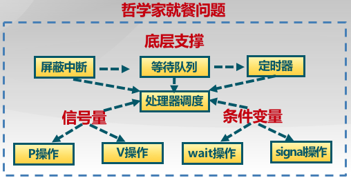
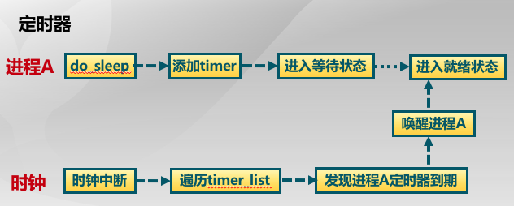
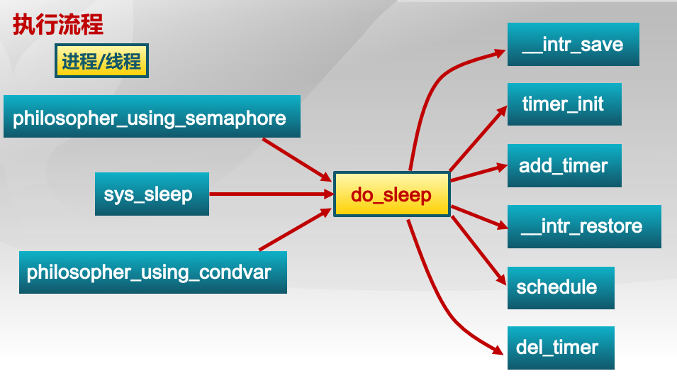
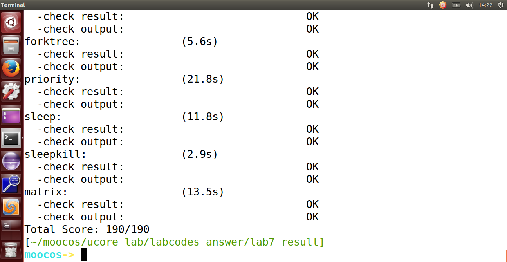

## lab7 实验报告

### 练习0：填写已有实验

`lab7` 会依赖 `lab1~lab6` ，我们需要把做的 `lab1~lab6` 的代码填到 `lab7` 中缺失的位置上面。练习 0 就是一个工具的利用。这里我使用的是 `Linux` 下的系统已预装好的 `Meld Diff Viewer` 工具。和 `lab6` 操作流程一样，我们只需要将已经完成的 `lab1~lab6` 与待完成的 `lab7`  (由于 `lab7` 是基于 `lab1~lab6` 基础上完成的，所以这里只需要导入 `lab6` )分别导入进来，然后点击 `compare` 就行了。


然后软件就会自动分析两份代码的不同，然后就一个个比较比较复制过去就行了，在软件里面是可以支持打开对比复制了，点击 `Copy Right` 即可。当然 `bin` 目录和 `obj` 目录下都是 `make` 生成的，就不用复制了，其他需要修改的地方主要有以下七个文件，通过对比复制完成即可：

```c
proc.c
default_pmm.c
pmm.c
swap_fifo.c
vmm.c
trap.c
sche.c
```

根据试验要求，我们需要对部分代码进行改进，这里讲需要改进的地方只有一处：

**trap.c() 函数**

修改的部分如下：

```c
static void trap_dispatch(struct trapframe *tf) {
    ++ticks;
    /* 注销掉下面这一句 因为这一句被包含在了 run_timer_list()
        run_timer_list() 在之前的基础上 加入了对 timer 的支持 */
    // sched_class_proc_tick(current);
    run_timer_list();
}
```

### 练习1: 理解内核级信号量的实现和基于内核级信号量的哲学家就餐问题（不需要编码）

在完成本练习之前，先说明下什么是哲学家就餐问题：

> 哲学家就餐问题，即有五个哲学家，他们的生活方式是交替地进行思考和进餐。哲学家们公用一张圆桌，周围放有五把椅子，每人坐一把。在圆桌上有五个碗和五根筷子，当一个哲学家思考时，他不与其他人交谈，饥饿时便试图取用其左、右最靠近他的筷子，但他可能一根都拿不到。只有在他拿到两根筷子时，方能进餐，进餐完后，放下筷子又继续思考。



在分析之前，我们先对信号量有个了解，既然要理解信号量的实现方法，我们可以先看看信号量的伪代码：

```c
struct semaphore {
  int count;
  queueType queue;
};

void P(semaphore S){
  S.count--；
  if (S.count<0) {
    把进程置为睡眠态；
    将进程的PCB插入到S.queue的队尾；
    调度，让出CPU；
  }
}

void V(semaphore S){
    S.count++；
    if (S.count≤0) {
    唤醒在S.queue上等待的第一个进程；
  }
}
```

基于上诉信号量实现可以认为，当多个进程可以进行互斥或同步合作时，一个进程会由于无法满足信号量设置的某条件而在某一位置停止，直到它接收到一个特定的信号（表明条件满足了）。为了发信号，需要使用一个称作信号量的特殊变量。为通过信号量 s 传送信号，信号量通过 V、P 操作来修改传送信号量。 

- count > 0，表示共享资源的空闲数

- count < 0，表示该信号量的等待队列里的进程数

- count = 0，表示等待队列为空

实验 7 的主要任务是实现基于信号量和管程去解决哲学家就餐问题，我们知道，解决哲学家就餐问题需要创建与之相对应的内核线程，而所有内核线程的创建都离不开 pid 为 1 的那个内核线程——idle，此时我们需要去寻找在实验 4 中讨论过的地方，如何创建并初始化 idle 这个内核线程。

在实验 7 中，具体的信号量数据结构被定义在（kern/sync/sem.h）中：

```c
typedef struct {
    int value;
    wait_queue_t wait_queue;
} semaphore_t;
```

找到相关函数 init_main（kern/process/proc.c，838——863行）

```c
static int init_main(void *arg) {
    size_t nr_free_pages_store = nr_free_pages();
    size_t kernel_allocated_store = kallocated();
 
    int pid = kernel_thread(user_main, NULL, 0);
    if (pid <= 0) {
        panic("create user_main failed.\n");
    }
 	extern void check_sync(void);
    check_sync();                // check philosopher sync problem
 
    while (do_wait(0, NULL) == 0) {
        schedule();
    }
 
    cprintf("all user-mode processes have quit.\n");
    assert(initproc->cptr == NULL && initproc->yptr == NULL && initproc->optr == NULL);
    assert(nr_process == 2);
    assert(list_next(&proc_list) == &(initproc->list_link));
    assert(list_prev(&proc_list) == &(initproc->list_link));
    assert(nr_free_pages_store == nr_free_pages());
    assert(kernel_allocated_store == kallocated());
    cprintf("init check memory pass.\n");
    return 0;
}
```

该函数与实验四基本没有不同之处，唯一的不同在于它调用了 check_sync() 这个函数去执行了哲学家就餐问题。

我们分析 check_sync 函数（kern/sync/check_sync.c，182+行）：

```c
void check_sync(void)
{
    int i;
    //check semaphore
    sem_init(&mutex, 1);
    for(i=0;i<N;i++) {            //N是哲学家的数量
        sem_init(&s[i], 0);       //初始化信号量
        int pid = kernel_thread(philosopher_using_semaphore, (void *)i, 0);//线程需要执行的函数名、哲学家编号、0表示共享内存
        //创建哲学家就餐问题的内核线程
        if (pid <= 0) {		//创建失败的报错
            panic("create No.%d philosopher_using_semaphore failed.\n");
        }
        philosopher_proc_sema[i] = find_proc(pid);
        set_proc_name(philosopher_proc_sema[i], "philosopher_sema_proc");
    }
 
    //check condition variable
    monitor_init(&mt, N);
    for(i=0;i<N;i++){
        state_condvar[i]=THINKING;
        int pid = kernel_thread(philosopher_using_condvar, (void *)i, 0);
        if (pid <= 0) {
            panic("create No.%d philosopher_using_condvar failed.\n");
        }
        philosopher_proc_condvar[i] = find_proc(pid);
        set_proc_name(philosopher_proc_condvar[i], "philosopher_condvar_proc");
    }
}
```

通过观察函数的注释，我们发现，这个 check_sync 函数被分为了两个部分，第一部分使用了信号量来解决哲学家就餐问题，第二部分则是使用管程的方法。因此，练习 1 中我们只需要关注前半段。

首先观察到利用 kernel_thread 函数创建了一个哲学家就餐问题的内核线程（kern/process/proc.c，270——280行）

```c
int kernel_thread(int (*fn)(void *), void *arg, uint32_t clone_flags) {
    struct trapframe tf;  //中断相关
    memset(&tf, 0, sizeof(struct trapframe));
    tf.tf_cs = KERNEL_CS;
    tf.tf_ds = tf.tf_es = tf.tf_ss = KERNEL_DS;
    tf.tf_regs.reg_ebx = (uint32_t)fn;
    tf.tf_regs.reg_edx = (uint32_t)arg;
    tf.tf_eip = (uint32_t)kernel_thread_entry;
    return do_fork(clone_flags | CLONE_VM, 0, &tf);
}
```

简单的来说，这个函数需要传入三个参数：

- 第一个 fn 是一个函数，代表这个创建的内核线程中所需要执行的函数；
- 第二个 arg 是相关参数，这里传入的是哲学家编号 i；
- 第三部分是共享内存的标记位，内核线程之间内存是共享的，因此应该设置为 0。

其余地方则是设置一些寄存器的值，保留需要执行的函数开始执行的地址，以便创建了新的内核线程之后，函数能够在内核线程中找到入口地址，执行函数功能。

接下来，让我们来分析需要创建的内核线程去执行的目标函数 philosopher_using_semaphore（kern/sync/check_sync.c，52——70行）

```c
int philosopher_using_semaphore(void * arg)/* i：哲学家号码，从0到N-1 */
{
    int i, iter=0;
    i=(int)arg;	//传入的参数转为 int 型，代表哲学家的编号
    cprintf("I am No.%d philosopher_sema\n",i);
    while(iter++<TIMES)	/* 无限循环 在这里我们取了 TIMES=4*/
    {
        cprintf("Iter %d, No.%d philosopher_sema is thinking\n",iter,i);// 哲学家正在思考
        do_sleep(SLEEP_TIME);//等待
        phi_take_forks_sema(i);// 需要两只叉子，或者阻塞
        cprintf("Iter %d, No.%d philosopher_sema is eating\n",iter,i);// 进餐
        do_sleep(SLEEP_TIME);
        phi_put_forks_sema(i);// 把两把叉子同时放回桌子
    }		//哲学家思考一段时间，吃一段时间饭
    cprintf("No.%d philosopher_sema quit\n",i);
    return 0;
}
```

参数及其分析：

- 传入参数 *arg，代表在上一个函数中“参数”部分定义的 (void *)i，是哲学家的编号。

- iter++<TIMES，表示循环 4 次，目的在于模拟多次试验情况。 

从这个函数，我们看到，哲学家需要思考一段时间，然后吃一段时间的饭，这里面的“一段时间”就是通过系统调用 sleep 实现的，内核线程调用 sleep，然后这个线程休眠指定的时间，从某种方面模拟了吃饭和思考的过程。

以下是 do_sleep 的实现：（kern/process/proc.c，922+行）

```c
int do_sleep(unsigned int time) {
    if (time == 0) {
        return 0;
    }
    bool intr_flag;
    local_intr_save(intr_flag);//关闭中断
    timer_t __timer, *timer = timer_init(&__timer, current, time);
    //声明一个定时器，并将其绑定到当前进程 current 上
    current->state = PROC_SLEEPING;
    current->wait_state = WT_TIMER;
    add_timer(timer);
    local_intr_restore(intr_flag);
 
    schedule();
 
    del_timer(timer);
    return 0;
}
```

我们看到，睡眠的过程中是无法被打断的，符合我们一般的认识，因为它在计时器使用的过程中通过 local_intr_save 关闭了中断，且利用了 timer_init 定时器函数，去记录指定的时间（传入的参数time），且在这个过程中，将进程的状态设置为睡眠，调用函数 add_timer 将绑定该进程的计时器加入计时器队列。当计时器结束之后，打开中断，恢复正常。

而反过来看传入的参数，即为定时器的定时值 time，在上一层函数中，传入的是 kern/sync/check_sync.c，14 行的宏定义，TIME 的值为 10。

相关的图解如下：



目前看来，最关键的函数是 phi_take_forks_sema(i) 和 phi_take_forks_sema(i);

phi_take_forks_sema、phi_take_forks_sema 函数如下所示：（kern/sync/check_sync,c，34——50行）

```c
void phi_take_forks_sema(int i)            /* i：哲学家号码从 0 到 N-1 */
{
        down(&mutex);                      /* 进入临界区 */
        state_sema[i]=HUNGRY;              /* 记录下哲学家 i 饥饿的事实 */
        phi_test_sema(i);                  /* 试图得到两只叉子 */
        up(&mutex);                        /* 离开临界区 */
        down(&s[i]);                       /* 如果得不到叉子就阻塞 */
}
 
void phi_put_forks_sema(int i)             /* i：哲学家号码从 0 到 N-1 */
{
        down(&mutex);                      /* 进入临界区 */
        state_sema[i]=THINKING;            /* 哲学家进餐结束 */
        phi_test_sema(LEFT);               /* 看一下左邻居现在是否能进餐 */
        phi_test_sema(RIGHT);              /* 看一下右邻居现在是否能进餐 */
        up(&mutex);                        /* 离开临界区 */
}
```

参数解释：

- 传入参数 i：当前哲学家的编号；
- mutex、state_sema：定义在当前文件的第 17——19 行，分别为每个哲学家记录当前的状态。

其中，mutex 的数据类型是“信号量结构体”，其定义在 kern/sync/sem.h 中：

```c
typedef struct {
    int value;
    wait_queue_t wait_queue;
} semaphore_t;
```

现在来到了最关键的核心问题解决部分，首先是 down 和 up 操作：（kern/sync/sem.c，16——54行）

```c
static __noinline void __up(semaphore_t *sem, uint32_t wait_state) {
    bool intr_flag;
    local_intr_save(intr_flag);//关闭中断
    {
        wait_t *wait;
        if ((wait = wait_queue_first(&(sem->wait_queue))) == NULL) {//没有进程等待
            sem->value ++;		//如果没有进程等待，那么信号量加一
        }
        //有进程在等待
        else {		//否则唤醒队列中第一个进程
            assert(wait->proc->wait_state == wait_state);
            wakeup_wait(&(sem->wait_queue), wait, wait_state, 1);//将 wait_queue 中等待的第一个 wait 删除，并将该进程唤醒
        }
    }
    local_intr_restore(intr_flag);		//开启中断，正常执行
}
```

up 函数的作用是：首先关中断，如果信号量对应的 wait queue 中没有进程在等待，直接把信号量的 value 加一，然后开中断返回；如果有进程在等待且进程等待的原因是 semophore 设置的，则调用 wakeup_wait 函数将 waitqueue 中等待的第一个 wait 删除，且把此 wait 关联的进程唤醒，最后开中断返回。

```c
static __noinline uint32_t __down(semaphore_t *sem, uint32_t wait_state) {
    bool intr_flag;
    local_intr_save(intr_flag);      //关闭中断
    if (sem->value > 0) {            //如果信号量大于 0，那么说明信号量可用，因此可以分配给当前进程运行，分配完之后关闭中断
        sem->value --;//直接让 value 减一
        local_intr_restore(intr_flag);//打开中断返回
        return 0;
    }
    //当前信号量value小于等于0，表明无法获得信号量
    wait_t __wait, *wait = &__wait;
    wait_current_set(&(sem->wait_queue), wait, wait_state);//将当前的进程加入到等待队列中
    local_intr_restore(intr_flag);//打开中断
    //如果信号量数值小于零，那么需要将当前进程加入等待队列并调用 schedule 函数查找下一个可以被运行调度的进程，此时，如果能够查到，那么唤醒，并将其中队列中删除并返回
    schedule();//运行调度器选择其他进程执行
 
    local_intr_save(intr_flag);//关中断
    wait_current_del(&(sem->wait_queue), wait);//被 V 操作唤醒，从等待队列移除
    local_intr_restore(intr_flag);//开中断
 
    if (wait->wakeup_flags != wait_state) {
        return wait->wakeup_flags;
    }
    return 0;
}
```

down 函数的作用是：首先关掉中断，然后判断当前信号量的 value 是否大于 0。如果是 >0，则表明可以获得信号量，故让 value 减一，并打开中断返回即可；如果不是 >0，则表明无法获得信号量，故需要将当前的进程加入到等待队列中，并打开中断，然后运行调度器选择另外一个进程执行。如果被 V 操作唤醒，则把自身关联的 wait 从等待队列中删除（此过程需要先关中断，完成后开中断）。

其中，这里调用了 local_intr_save 和 local_intr_restore 两个函数，它们被定义在（kern/sync/sync.h，11——25行）：

```c
static inline bool __intr_save(void) { //临界区代码
    if (read_eflags() & FL_IF) {
        intr_disable();
        return 1;
    }
    return 0;
}
static inline void __intr_restore(bool flag) {
    if (flag) {
        intr_enable();
    }
}
```

很容易发现他们的功能是关闭和打开中断。


分析完了 up 和 down，让我们来分析一下 test 函数：

 ```c
phi_test_sema(LEFT); /* 看一下左邻居现在是否能进餐 */

phi_test_sema(RIGHT); /* 看一下右邻居现在是否能进餐 */
 ```

该函数被定义在（kern/sync/check_sync.c，86——94行）：

 ```c
void phi_test_sema(i)
{
    if(state_sema[i]==HUNGRY&&state_sema[LEFT]!=EATING
            &&state_sema[RIGHT]!=EATING)
    {
        state_sema[i]=EATING;
        up(&s[i]);
    }
}
 ```

在试图获得筷子的时候，函数的传入参数为 i，即为哲学家编号，此时，他自己为 HUNGRY，而且试图检查旁边两位是否都在吃。如果都不在吃，那么可以获得 EATING 的状态。

在从吃的状态返回回到思考状态的时候，需要调用两次该函数，传入的参数为当前哲学家左边和右边的哲学家编号，因为他试图唤醒左右邻居，如果左右邻居满足条件，那么就可以将他们设置为 EATING 状态。

其中，LEFT 和 RIGHT 的定义如下：

 ```c
#define LEFT (i-1+N)%N

#define RIGHT (i+1)%N
 ```

由于哲学家坐圆桌，因此可以使用余数直接获取左右编号。

练习一的总体执行流程如下：




> 请在实验报告中给出内核级信号量的设计描述，并说其大致执行流流程。

实现了内核级信号量机制的函数均定义在 sem.c 中，因此对上述这些函数分析总结如下： 

- `sem_init`：对信号量进行初始化的函数，根据在原理课上学习到的内容，信号量包括了等待队列和一个整型数值变量，该函数只需要将该变量设置为指定的初始值，并且将等待队列初始化即可；
- `__up`：对应到了原理课中提及到的 V 操作，表示释放了一个该信号量对应的资源，如果有等待在了这个信号量上的进程，则将其唤醒执行；结合函数的具体实现可以看到其采用了禁用中断的方式来保证操作的原子性，函数中操作的具体流程为： 
  - 查询等待队列是否为空，如果是空的话，给整型变量加 1；
  - 如果等待队列非空，取出其中的一个进程唤醒；
- `__down`：同样对应到了原理课中提及的P操作，表示请求一个该信号量对应的资源，同样采用了禁用中断的方式来保证原子性，具体流程为： 
  - 查询整型变量来了解是否存在多余的可分配的资源，是的话取出资源（整型变量减 1），之后当前进程便可以正常进行；
  - 如果没有可用的资源，整型变量不是正数，当前进程的资源需求得不到满足，因此将其状态改为 SLEEPING 态，然后将其挂到对应信号量的等待队列中，调用 schedule 函数来让出 CPU，在资源得到满足，重新被唤醒之后，将自身从等待队列上删除掉；
- `up, down`：对 `__up, __down` 函数的简单封装；
- `try_down`：不进入等待队列的 P 操作，即时是获取资源失败也不会堵塞当前进程；

> 请在实验报告中给出给用户态进程/线程提供信号量机制的设计方案，并比较说明给内核级提供信号量机制的异同。

将内核信号量机制迁移到用户态的最大麻烦在于，用于保证操作原子性的禁用中断机制、以及 CPU 提供的 Test and Set 指令机制都只能在用户态下运行，而使用软件方法的同步互斥又相当复杂，这就使得没法在用户态下直接实现信号量机制；于是，为了方便起见，可以将信号量机制的实现放在 OS 中来提供，然后使用系统调用的方法统一提供出若干个管理信号量的系统调用，分别如下所示： 

- 申请创建一个信号量的系统调用，可以指定初始值，返回一个信号量描述符(类似文件描述符)；
- 将指定信号量执行 P 操作；
- 将指定信号量执行 V 操作；
- 将指定信号量释放掉；

给内核级线程提供信号量机制和给用户态进程/线程提供信号量机制的异同点在于： 

- 相同点： 
  - 提供信号量机制的代码实现逻辑是相同的；
- 不同点： 
  - 由于实现原子操作的中断禁用、Test and Set 指令等均需要在内核态下运行，因此提供给用户态进程的信号量机制是通过系统调用来实现的，而内核级线程只需要直接调用相应的函数就可以了；

### 练习2: 完成内核级条件变量和基于内核级条件变量的哲学家就餐问题（需要编码）

首先掌握管程机制，然后基于信号量实现完成条件变量实现，然后用管程机制实现哲学家就餐问题的解决方案（基于条件变量）。

一个管程定义了一个数据结构和能为并发进程所执行(在该数据结构上)的一组操作，这组操作能同步进程和改变管程中的数据。

管程主要由这四个部分组成：

- 1、管程内部的共享变量；

- 2、管程内部的条件变量；

- 3、管程内部并发执行的进程；

- 4、对局部于管程内部的共享数据设置初始值的语句。

管程相当于一个隔离区，它把共享变量和对它进行操作的若干个过程围了起来，所有进程要访问临界资源时，都必须经过管程才能进入，而管程每次只允许一个进程进入管程，从而需要确保进程之间互斥。

但在管程中仅仅有互斥操作是不够用的。进程可能需要等待某个条件 C 为真才能继续执行。

所谓条件变量，即将等待队列和睡眠条件包装在一起，就形成了一种新的同步机制，称为条件变量。一个条件变量 CV 可理解为一个进程的等待队列，队列中的进程正等待某个条件C变为真。每个条件变量关联着一个断言 "断言"  PC。当一个进程等待一个条件变量，该进程不算作占用了该管程，因而其它进程可以进入该管程执行，改变管程的状态，通知条件变量 CV 其关联的断言 PC 在当前状态下为真。

因而条件变量两种操作如下：

- `wait_cv`： 被一个进程调用,以等待断言 PC 被满足后该进程可恢复执行。进程挂在该条件变量上等待时，不被认为是占用了管程。如果条件不能满足，就需要等待。

- `signal_cv`：被一个进程调用，以指出断言 PC 现在为真，从而可以唤醒等待断言 PC 被满足的进程继续执行。如果条件可以满足，那么可以运行。

在 ucore 中，管程数据结构被定义在（kern/sync/monitor.h）中：

```c
// 管程数据结构
typedef struct monitor{
    // 二值信号量，用来互斥访问管程，只允许一个进程进入管程，初始化为 1
    semaphore_t mutex; // 二值信号量 用来互斥访问管程
    //用于进程同步操作的信号量
    semaphore_t next;// 用于条件同步（进程同步操作的信号量），发出 signal 操作的进程等条件为真之前进入睡眠
    // 睡眠的进程数量
    int next_count;// 记录睡在 signal 操作的进程数
    // 条件变量cv
    condvar_t *cv;// 条件变量
} monitor_t;
```

管程中的成员变量 mutex 是一个二值信号量，是实现每次只允许一个进程进入管程的关键元素，确保了互斥访问性质。

管程中的条件变量 cv 通过执行 wait_cv，会使得等待某个条件 C 为真的进程能够离开管程并睡眠，且让其他进程进入管程继续执行；而进入管程的某进程设置条件 C 为真并执行 signal_cv 时，能够让等待某个条件 C 为真的睡眠进程被唤醒，从而继续进入管程中执行。

管程中的成员变量信号量 next 和整形变量 next_count 是配合进程对条件变量 cv 的操作而设置的，这是由于发出signal_cv 的进程 A 会唤醒睡眠进程 B，进程 B 执行会导致进程 A 睡眠，直到进程 B 离开管程，进程 A 才能继续执行，这个同步过程是通过信号量 next 完成的；

而 next_count 表示了由于发出 singal_cv 而睡眠的进程个数。

其中，条件变量 cv 的数据结构也被定义在同一个位置下：

```c
// 条件变量数据结构
typedef struct condvar{
    // 用于条件同步 用于发出 wait 操作的进程等待条件为真之前进入睡眠
    semaphore_t sem;     	//用于发出 wait_cv 操作的等待某个条件 C 为真的进程睡眠
    // 记录睡在 wait 操作的进程数(等待条件变量成真)
    int count;            //在这个条件变量上的睡眠进程的个数
    // 所属管程
    monitor_t * owner;		//此条件变量的宿主管程
} condvar_t;
```

条件变量的定义中也包含了一系列的成员变量，信号量 sem 用于让发出 wait_cv 操作的等待某个条件 C 为真的进程睡眠，而让发出 signal_cv 操作的进程通过这个 sem 来唤醒睡眠的进程。count 表示等在这个条件变量上的睡眠进程的个数。owner 表示此条件变量的宿主是哪个管程。

其实本来条件变量中需要有等待队列的成员，以表示有多少线程因为当前条件得不到满足而等待，但这里，直接采用了信号量替代，因为信号量数据结构中也含有等待队列。

我们对管程进行初始化操作：

```c
// 初始化管程
void monitor_init (monitor_t * mtp, size_t num_cv) {
    int i;
    assert(num_cv>0);
    mtp->next_count = 0; // 睡在 signal 进程数 初始化为 0
    mtp->cv = NULL;
    sem_init(&(mtp->mutex), 1); // 二值信号量 保护管程 使进程访问管程操作为互斥的
    sem_init(&(mtp->next), 0); // 条件同步信号量
    mtp->cv =(condvar_t *) kmalloc(sizeof(condvar_t)*num_cv); // 获取一块内核空间 放置条件变量
    assert(mtp->cv!=NULL);
    for(i=0; i<num_cv; i++){
        mtp->cv[i].count=0;
        sem_init(&(mtp->cv[i].sem),0);
        mtp->cv[i].owner=mtp;
    }
}
```

那么现在开始解决哲学家就餐问题，使用管程，它的实现在（kern/sync/check_sync，199+行）

```c
monitor_init(&mt, N);   //初始化管程
for(i=0;i<N;i++){
    state_condvar[i]=THINKING;
    int pid = kernel_thread(philosopher_using_condvar, (void *)i, 0);
    if (pid <= 0) {
        panic("create No.%d philosopher_using_condvar failed.\n");
    }
    philosopher_proc_condvar[i] = find_proc(pid);
    set_proc_name(philosopher_proc_condvar[i], "philosopher_condvar_proc");
}
```

我们发现，这个实现过程和使用信号量无差别，不同之处在于，各个线程所执行的函数不同，此处执行的为 philosopher_using_condvar 函数：

philosopher_using_condvar 函数被定义在（kern/sync/check_sync，162——180行）

```c
int philosopher_using_condvar(void * arg) { /* arg is the No. of philosopher 0~N-1*/
  
    int i, iter=0;
    i=(int)arg;
    cprintf("I am No.%d philosopher_condvar\n",i);
    while(iter++<TIMES)
    { /* iterate*/
        cprintf("Iter %d, No.%d philosopher_condvar is thinking\n",iter,i); /* thinking*/
        do_sleep(SLEEP_TIME);
        phi_take_forks_condvar(i); 
        /* need two forks, maybe blocked */
        cprintf("Iter %d, No.%d philosopher_condvar is eating\n",iter,i); /* eating*/
        do_sleep(SLEEP_TIME);
        phi_put_forks_condvar(i); 
        /* return two forks back*/
    }
    cprintf("No.%d philosopher_condvar quit\n",i);
    return 0;    
}
```

我们发现这里和用信号量还是没有本质的差别，不同之处在于，获取筷子和放下都使用了不同的，配套管程使用的函数 phi_take_forks_condvar 和 phi_put_forks_condvar。

phi_take_forks_condvar 和 phi_put_forks_condvar 被定义在（kern/sync/check_sync，121——159行）

其中，mtp 为一个管程，声明于同一文件下的第 108 行，state_convader 数组记录哲学家的状态，声明于第107行。

```c
// 拿刀叉
/*
* phi_take_forks_condvar() 函数实现思路：
  1. 获取管程的锁
  2. 将自己设置为饥饿状态
  3. 判断当前叉子是否足够就餐，如不能，等待其他人释放资源
  4. 释放管程的锁
*/ 
void phi_take_forks_condvar(int i) {
     down(&(mtp->mutex));	//保证互斥操作，P 操作进入临界区
//--------into routine in monitor--------------
     // LAB7 EXERCISE1: YOUR CODE
     // I am hungry
     // try to get fork
      // I am hungry
      state_condvar[i]=HUNGRY; // 饥饿状态，准备进食
      // try to get fork
      phi_test_condvar(i);		//测试哲学家是否能拿到刀叉，若不能拿，则阻塞自己，等其它进程唤醒
      if (state_condvar[i] != EATING) {	//没拿到，需要等待，调用 wait 函数
          cprintf("phi_take_forks_condvar: %d didn't get fork and will wait\n",i);
          cond_wait(&mtp->cv[i]);
      }
//--------leave routine in monitor--------------
      if(mtp->next_count>0)
         up(&(mtp->next));
      else
         up(&(mtp->mutex));
}
```

这个地方的意思是，如果当前管程的等待数量在唤醒了一个线程之后，还有进程在等待，那么就会唤醒控制当前进程的信号量，让其他进程占有它，如果没有等待的了，那么直接释放互斥锁，这样就可以允许新的进程进入管程了。

```c
// 放刀叉
/*
* phi_put_forks_condvar() 函数实现思路：
  1. 获取管程的锁
  2. 将自己设置为思考状态
  3. 判断左右邻居的哲学家是否可以从等待就餐的状态中恢复过来
*/ 
void phi_put_forks_condvar(int i) {
     down(&(mtp->mutex));// P 操作进入临界区
 
//--------into routine in monitor--------------
     // LAB7 EXERCISE1: YOUR CODE
     // I ate over
     // test left and right neighbors
      // I ate over 
      state_condvar[i]=THINKING;// 思考状态
      // test left and right neighbors
      // 试试左右两边能否获得刀叉
      phi_test_condvar(LEFT);
      phi_test_condvar(RIGHT);		//唤醒左右哲学家，试试看他们能不能开始吃
//--------leave routine in monitor--------------
     if(mtp->next_count>0)// 有哲学家睡在 signal 操作，则将其唤醒
        up(&(mtp->next));
     else
        up(&(mtp->mutex));//离开临界区
}
```

和信号量的实现差不多，我们在拿起筷子和放下的时候，主要都还要唤醒相邻位置上的哲学家，但是，具体的test操作中，实现有所不同。test 函数被定义在（同文件，110——118行）

```c
// 测试编号为i的哲学家是否能获得刀叉 如果能获得 则将状态改为正在吃 并且 尝试唤醒 因为wait操作睡眠的进程
// cond_signal 还会阻塞自己 等被唤醒的进程唤醒自己
void phi_test_condvar (i) {
    if(state_condvar[i]==HUNGRY&&state_condvar[LEFT]!=EATING
            &&state_condvar[RIGHT]!=EATING) {
        cprintf("phi_test_condvar: state_condvar[%d] will eating\n",i);
        state_condvar[i] = EATING ;
        cprintf("phi_test_condvar: signal self_cv[%d] \n",i);
        cond_signal(&mtp->cv[i]);		
        //如果可以唤醒，那么signal操作掉代表这个哲学家那个已经睡眠等待的进程。和wait是对应的。
    }
}
```

上述这一过程可以被描述为如下的流程图：

```c
哲学家->试试拿刀叉->能拿->signal 唤醒被wait阻塞的进程->阻塞自己
                  |             |                  A
                  |             V                  |
                  ->不能拿->wait阻塞自己             |
                                                   |
哲学家->放刀叉->让左右两边试试拿刀叉->有哲学家睡在signal 唤醒他
```

现在看来，最主要的部分在于管程的 signal 和 wait 操作，ucore 操作系统中对于 signal 和 wait 操作的实现是有专门的函数的，它们是 cond_signal 和 cond_wait（kern/sync/monitor.c，26——72行，代码实现部分）

```c
// 管程signal操作
/*
分支1. 因为条件不成立而睡眠的进程计数小于等于0 时 说明 没有进程需要唤醒 则直接返回
分支2. 因为条件不成立而睡眠的进程计数大于0 说明有进程需要唤醒 就将其唤醒
同时设置 条件变量所属管程的 next_count 加1 以用来告诉 wait操作 有进程睡在了 signal操作上
然后自己将自己阻塞 等待条件同步 被唤醒 被唤醒后 睡在 signal 操作上的进程应该减少 故 next_count 应减 1
*/
void cond_signal (condvar_t *cvp) {
   //LAB7 EXERCISE1: YOUR CODE
   cprintf("cond_signal begin: cvp %x, cvp->count %d, cvp->owner->next_count %d\n", cvp, cvp->count, cvp->owner->next_count);		//这是一个输出信息的语句，可以不管
   /*
   * cond_signal() 函数实现思路：
     1. 判断条件变量的等待队列是否为空
     2. 修改 next 变量上等待进程计数，跟下一个语句不能交换位置，为了得到互斥访问的效果，关键在于访问共享变量的时候，管程中是否只有一个进程处于 RUNNABLE 的状态
     3. 唤醒等待队列中的某一个进程
     4. 把自己等待在 next 条件变量上
     5. 当前进程被唤醒，恢复 next 上的等待进程计数
   */ 
   if(cvp->count>0) {
       cvp->owner->next_count ++;  //管程中睡眠的数量
       up(&(cvp->sem));            //唤醒在条件变量里睡眠的进程
       down(&(cvp->owner->next));  //将在管程中的进程睡眠
       cvp->owner->next_count --;
   }
   cprintf("cond_signal end: cvp %x, cvp->count %d, cvp->owner->next_count %d\n", cvp, cvp->count, cvp->owner->next_count);
}
```

首先判断 cvp.count，如果不大于 0，则表示当前没有睡眠在这一个条件变量上的进程，因此就没有被唤醒的对象了，直接函数返回即可，什么也不需要操作。

如果大于 0，这表示当前有睡眠在该条件变量上的进程，因此需要唤醒等待在cv.sem上睡眠的进程。而由于只允许一个进程在管程中执行，所以一旦进程 B 唤醒了别人（进程A），那么自己就需要睡眠。故让 monitor.next_count 加一，且让自己（进程B）睡在信号量 monitor.next（宿主管程的信号量）上。如果睡醒了，这让 monitor.next_count 减一。 

这里为什么最后要加一个 `next_conut--` 呢？这说明上一句中的 down 的进程睡醒了，那么睡醒，就必然是另外一个进程唤醒了它，因为只能有一个进程在管程中被 signal，如果有进程调用了 wait，那么必然需要 signal 另外一个进程，我们可以从下图可以看到这一调用过程：


我们来看 wait 函数：

```c
// 管程wait操作
/*
先将 因为条件不成立而睡眠的进程计数加1
分支1. 当 管程的 next_count 大于 0 说明 有进程睡在了 signal 操作上 我们将其唤醒
分支2. 当 管程的 next_count 小于 0 说明 当前没有进程睡在 signal 操作数 只需要释放互斥体
然后 再将 自身阻塞 等待 条件变量的条件为真 被唤醒后 将条件不成立而睡眠的进程计数减1 因为现在成立了
*/
void cond_wait (condvar_t *cvp) {
    //LAB7 EXERCISE1: YOUR CODE
    cprintf("cond_wait begin:  cvp %x, cvp->count %d, cvp->owner->next_count %d\n", cvp, cvp->count, cvp->owner->next_count);
   /*
   * cond_wait() 函数实现思路：
     1. 修改等待在条件变量的等待队列上的进程计数
     2. 释放锁
     3. 将自己等待在条件变量上
     4. 被唤醒，修正等待队列上的进程计数
   */ 
    cvp->count++;                  //条件变量中睡眠的进程数量加 1
    if(cvp->owner->next_count > 0)
       up(&(cvp->owner->next));	//如果当前有进程正在等待，且睡在宿主管程的信号量上，此时需要唤醒，让该调用了 wait 的睡，此时就唤醒了，对应上面讨论的情况。这是一个同步问题。
    else
       up(&(cvp->owner->mutex));	//如果没有进程睡眠，那么当前进程无法进入管程的原因就是互斥条件的限制。因此唤醒 mutex 互斥锁，代表现在互斥锁被占用，此时，再让进程睡在宿主管程的信号量上，如果睡醒了，count--，谁唤醒的呢？就是前面的 signal 啦，这其实是一个对应关系。
    down(&(cvp->sem));		//因为条件不满足，所以主动调用 wait 的进程，会睡在条件变量 cvp 的信号量上，是条件不满足的问题；而因为调用 signal 唤醒其他进程而导致自身互斥睡眠，会睡在宿主管程 cvp->owner 的信号量上，是同步的问题。两个有区别，不要混了，超级重要鸭！！！
 
    cvp->count --;
    cprintf("cond_wait end:  cvp %x, cvp->count %d, cvp->owner->next_count %d\n", cvp, cvp->count, cvp->owner->next_count);
}
```

如果进程 A 执行了 cond_wait 函数，表示此进程等待某个条件 C 不为真，需要睡眠。因此表示等待此条件的睡眠进程个数 cv.count 要加一。接下来会出现两种情况。

情况一：如果 monitor.next_count 如果大于 0，表示有大于等于 1 个进程执行 cond_signal 函数且睡着了，就睡在了 monitor.next 信号量上。假定这些进程形成 S 进程链表。因此需要唤醒 S 进程链表中的一个进程 B。然后进程 A 睡在 cv.sem 上，如果睡醒了，则让 cv.count 减一，表示等待此条件的睡眠进程个数少了一个，可继续执行。

情况二：如果 monitor.next_count 如果小于等于 0，表示目前没有进程执行 cond_signal 函数且睡着了，那需要唤醒的是由于互斥条件限制而无法进入管程的进程，所以要唤醒睡在 monitor.mutex 上的进程。然后进程 A 睡在 cv.sem 上，如果睡醒了，则让 cv.count 减一，表示等待此条件的睡眠进程个数少了一个，可继续执行了！

关于条件变量机制的实现主要位于 monitor.c 文件中的 `cond_signal, cond_wait` 两个函数中，这两个函数的含义分别表示提醒等待在这个条件变量上的进程恢复执行，以及等待在这个条件变量上，直到有其他进行将其唤醒位置，因此对上述这些函数分析总结如下： 

cond_signal：将指定条件变量上等待队列中的一个线程进行唤醒，并且将控制权转交给这个进程；具体执行流程为： 

- 判断当前的条件变量的等待队列上是否有正在等待的进程，如果没有则不需要进行任何操作；
- 如果由正在等待的进程，则将其中的一个唤醒，这里的等待队列是使用了一个信号量来进行实现的，由于信号量中已经包括了对等待队列的操作，因此要进行唤醒只需要对信号量执行 up 操作即可；
- 接下来当前进程为了将控制权转交给被唤醒的进程，将自己等待到了这个条件变量所述的管程的next信号量上，这样的话就可以切换到被唤醒的进程了；由于 next 信号量的实现，就带来了两个困惑： 
  - 等待在 next 信号量上的进程是否能够被唤醒？由于每一个 next 信号量上等待的进程的产生必定是因为存在了某个它需要唤醒的进程，而这个进程在结束 cond_wait 函数之后返回到管程的函数，还会检查 next 信号量上是否存在等待着的进程，有的话将其唤醒，因此每一个 next 信号量上等待的进程最终必定会被唤醒；
  - 在等待在 next 信号量上的时候，管程的 mutex 锁并没有被释放，是否可能存在该锁永远都被释放不了的情况？不会的。根据前一个问题得知所有 next 信号量上的等待进程一定会被唤醒，那么最后一个被唤醒的 next 进程就会将锁释放掉；

- 接下来，当前进程被从 next 信号量上被唤醒的时候，首先将 next count 减一，然后离开 cond_signal 函数，回到管程中的函数，检查是否应该释放管程的锁（取决于现在是否还有 next 信号量上等待的进程，有的话将其唤醒，完成其在函数中的操作，并且将释放锁的操作延迟给这个进程来进行），根据上述描述，我们可以知道在管程中能够运行的进程之间不会有互相有意料外的打断的过程（由于进程的切换时机都是固定好的，由当前的进程来唤醒另外某一个进程），因此实现了对共享变量访问的互斥性；

cond_wait：该函数的功能为将当前进程等待在指定信号量上，其操作过程为将等待队列的计数加1，然后释放管程的锁或者唤醒一个next上的进程来释放锁（否则会造成管程被锁死无法继续访问，同时这个操作不能和前面的等待队列计数加1的操作互换顺序，要不不能保证共享变量访问的互斥性），然后把自己等在条件变量的等待队列上，直到有signal信号将其唤醒，正常退出函数；

关于使用条件变量来完成哲学家就餐问题的实现中，总共有两个关键函数，以及使用到了 N（哲学家数量）个条件变量，在管程中，还包括了一个限制管程访问的锁还有 N 个用于描述哲学家状态的变量（总共有 EATING, THINKING, HUNGER）三种状态；

首先分析 phi_take_forks_condvar 函数的实现，该函数表示指定的哲学家尝试获得自己所需要进餐的两把叉子，如果不能获得则阻塞，具体实现流程为： 

- 给管程上锁；
- 将哲学家的状态修改为 HUNGER；
- 判断当前哲学家是否有足够的资源进行就餐（相邻的哲学家是否正在进餐）；
- 如果能够进餐，将自己的状态修改成 EATING，然后释放锁，离开管程即可；
- 如果不能进餐，等待在自己对应的条件变量上，等待相邻的哲学家释放资源的时候将自己唤醒；

而 phi_put_forks_condvar 函数则是释放当前哲学家占用的叉子，并且唤醒相邻的因为得不到资源而进入等待的哲学家： 

- 首先获取管程的锁；
- 将自己的状态修改成 THINKING；
- 检查相邻的哲学家是否在自己释放了叉子的占用之后满足了进餐的条件，如果满足，将其从等待中唤醒（使用 cond_signal）；
- 释放锁，离开管程；

- 由于限制了管程中在访问共享变量的时候处于 RUNNABLE 的进程只有一个，因此对进程的访问是互斥的；并且由于每个哲学家只可能占有所有需要的资源（叉子）或者干脆不占用资源，因此不会出现部分占有资源的现象，从而避免了死锁的产生；
- 根据上述分析，可知最终必定所有哲学将都能成功就餐；

> 请在实验报告中给出给用户态进程/线程提供条件变量机制的设计方案，并比较说明给内核级 提供条件变量机制的异同。

发现在本实验中管程的实现中互斥访问的保证是完全基于信号量的，也就是如果按照上文中的说明使用 syscall 实现了用户态的信号量的实现机制，那么就完全可以按照相同的逻辑在用户态实现管程机制和条件变量机制；

当然也可以仿照用户态实现条件变量的方式，将对访问管程的操作封装成系统调用；

异同点为： 

- 相同点：基本的实现逻辑相同；
- 不同点：最终在用户态下实现管程和条件变量机制，需要使用到操作系统使用系统调用提供一定的支持; 而在内核态下实现条件变量是不需要的；

> 请在实验报告中回答：能否不用基于信号量机制来完成条件变量？如果不能，请给出理由， 如果能，请给出设计说明和具体实现。

能够基于信号量来完成条件变量机制；事实上在本实验中就是这么完成的，只需要将使用信号量来实现条件变量和管程中使用的锁和等待队列即可。

最终的实验结果如下图所示：



如果 make grade 无法满分，尝试注释掉 tools/grade.sh 的 221 行到 233 行（在前面加上“#”）。

这里我们选用古老的编辑器 Vim，具体操作过程如下：

- 1、首先按 esc 进入命令行模式下，按下 `:221` 跳转至 221 行;
- 2、按下 Ctrl + v，进入列（也叫区块）模式;
- 3、在行首使用上下键选择需要注释的多行（221~233 行）;
- 4、按下键盘（大写）“I”键，进入插入模式；
- 5、然后输入注释符（“//”、“#”等）;
- 6、最后按下“Esc”键。

### 扩展练习

#### Challenge 1 ：在ucore中实现简化的死锁和重入探测机制

待完成。。。

#### Challenge 2 ：参考Linux的RCU机制，在ucore中实现简化的RCU机制

待完成。。。

### 参考资料

- http://www.ibm.com/developerworks/cn/linux/l-rcu/
- http://www.diybl.com/course/6_system/linux/Linuxjs/20081117/151814.html
- http://faculty.salina.k-state.edu/tim/ossg/IPC_sync/ts.html